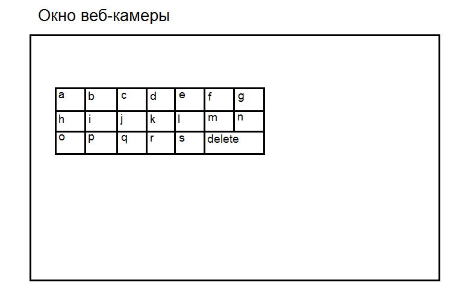
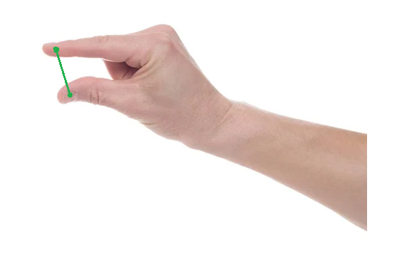

# Виртуальная клавиатура
Виртуальная клавиатура. Позволяет, используя веб-камеру, создать клавиатуру в окне программы, на которой можно печатать текст.

## Используемые библиотеки
- MediaPipe
- OpenCV

## Как использовать
Для начала работы программы запустите модуль main.py.
Для того чтобы напечатать текст в программе, необходимо поставить пальцы, как показано .
Наведитесь пальцами на нужную клавишу и сомкните их, тогда клавиша будет "нажата" и не забудьте их снова разомкнуть, чтобы
клавиша не "залипла".

### Подробнее
Более подробную информацию о написании вируальной клавиатуры можно узнать в статье: 
http://alloverai.ru/2024/09/28/virtualnaya-klaviatura-opencv-mediapipe/
